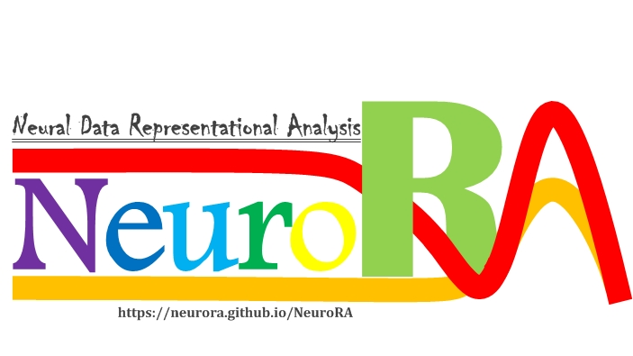
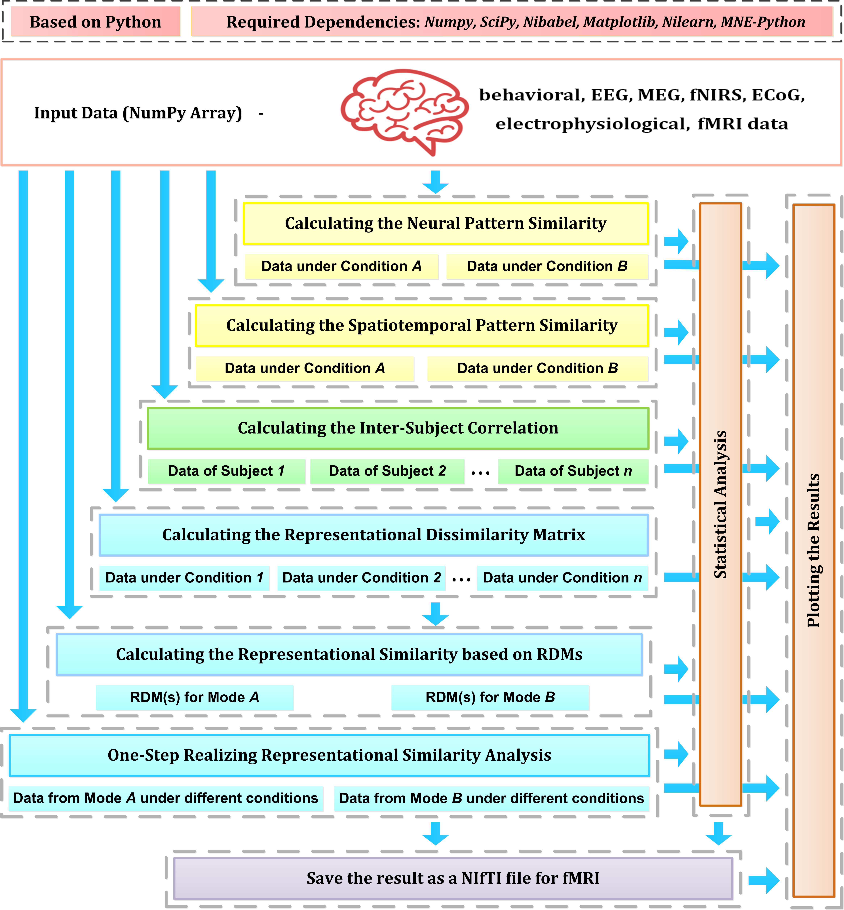
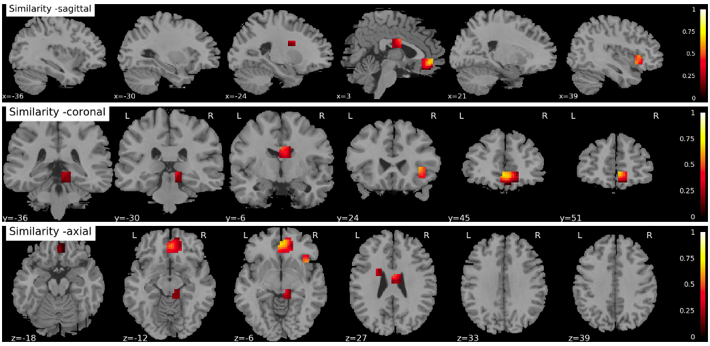

<meta name="google-site-verification" content="nSJP12yLCr6zLi5RzrkcJOfIrlut0Ro3Y63OOZ0_hdU" />
# NeuroRA

**A Python Toolbox of Representational Analysis from Multimode Neural Data**

## Overview
**Representational Similarity Analysis (RSA)** has become a popular and effective method to measure the representation of multivariable neural activity in different modes.

**NeuroRA** is an easy-to-use toolbox based on **Python**, which can do some works about **RSA** among nearly all kinds of neural data, including **behavioral, EEG, MEG, fNIRS, ECoG, electrophysiological and fMRI data**.
In addition, users can do **Neural Pattern Similarity (NPS)**, **Spatiotemporal Pattern Similarity (STPS)** & **Inter-Subject Correlation (ISC)** on **NeuroRA**.

## Paper

Lu, Z., & Ku, Y. NeuroRA: A Python toolbox of representational analysis from multi-modal neural data. (bioRxiv: https://doi.org/10.1101/2020.03.25.008086)

## Installation

> pip install neurora 

## Documentation

You can read or download the **[Tutorial here](https://zitonglu1996.github.io/NeuroRA/neurora/Tutorial.pdf)**.

## Required Dependencies:
- **[Numpy](http://www.numpy.org)**: a fundamental package for scientific computing
- **[SciPy](https://www.scipy.org/scipylib/index.html)**: a package that provides many user-friendly and efficient numerical routines.
- **[Matplotlib](https://matplotlib.org)**: a Python 2D plotting library
- **[NiBabel](https://nipy.org/nibabel/)**: a package prividing read +/- write access to some common medical and neuroimaging file formats
- **[Nilearn](https://nilearn.github.io/)**: a Python module for fast and easy statistical learning on NeuroImaging data
- **[MNE-Python](https://mne.tools/)**: a Python software for exploring, visualizing, and analyzing human neurophysiological data

## Features

- Calculate the Neural Pattern Similarity (NPS)

    > for each subject / for each time-point / searchlight / for ROI

- Calculate the Spatiotemporal Neural Pattern Similarity (STPS)

    > for each subject / searchlight / for ROI

- Calculate the Inter-Subject Correlation (ISC)

    > for each time-point / searchlight / for ROI

- Calculate the Representational Dissimilarity Matrix (RDM)

    > for each subject / for each channel / for each time-point / searchlight / for ROI / all in

- Calculate the Representational Similarity based on RDMs

    > for each subject / for each channel / for each time-point / searchlight / for ROI / all in

- One-Step Realize Representational Similarity Analysis (RSA)

    > for each subject / for each channel / for each time-point / searchlight / for ROI / all in

- Statistical Analysis

- Save the RSA results as a NIfTI file for fMRI

- Visualization for RSA results

## Typical Visualization Demos

- Representational Dissimilarity Matrix

    

- Representational Similarities by time sequence

    

- RSA-result for fMRI

    
    

## Script Demo to Know How to Use

There are two demos in Tutorial to let you know how to use NeuroRA to conduct representational analysis.

- **Demo 1 for EEG/MEG**, based on visual-92-categories-task MEG dataset, includes 8 sections.

    > **Section 1**: Loading example data
    
    > **Section 2**: Preprocessing
    
    > **Section 3**: Calculating the neural pattern similarity
    
    > **Section 4**: Calculating single RDM and Plotting
    
    > **Section 5**: Calculating RDMs and Plotting
    
    > **Section 6**: Calculating the Similarity between two RDMs
    
    > **Section 7**: Calculating the Similarity and Plotting
    
    > **Section 8**: Calculating the RDMs for each channels

- **Demo 2 for fMRI**, based on Haxby dataset, includes 8 sections.

    > **Section 1**: loading example data
    
    > **Section 2**: Preprocessing
    
    > **Section 3**: Calculating the neural pattern similarity (for ROI)
    
    > **Section 4**: Calculating the neural pattern similarity (Searchlight)
    
    > **Section 5**: Calculating the RDM for ROI and Plotting
    
    > **Section 6**: Calculating the RDM by Searchlight and Plotting
    
    > **Section 7**: Calculating the representational similarities between a coding model and neural activities
    
    > **Section 8**: Saving the RSA result and Plotting

Users can see more details in [Tutorial](https://zitonglu1996.github.io/NeuroRA/neurora/Tutorial.pdf) and [Demo Codes](https://github.com/zitonglu1996/NeuroRA/tree/master/demo).

## About NeuroRA

**Noteworthily**, this toolbox is currently only a **test version**. 
If you have any question, find some bugs or have some useful suggestions while using, you can email me and I will be happy and thankful to know.
>My email address: 
>zitonglu1996@gmail.com

>My personal homepage:
>https://zitonglu1996.github.io

